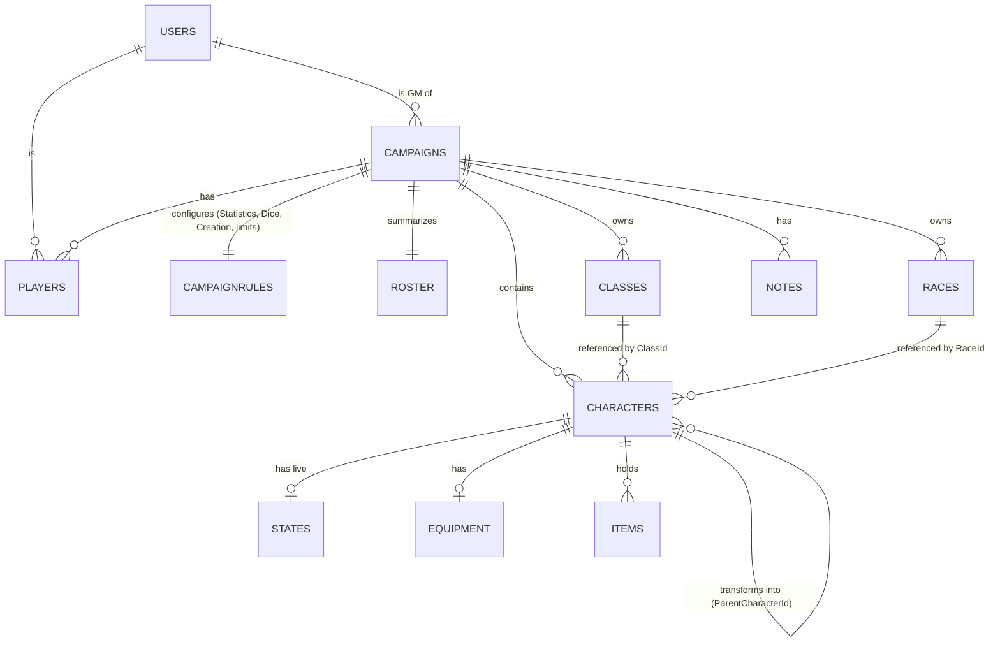

# RPG Platform — Data Model & Firestore Documentation

A campaign-oriented tabletop RPG platform built on Firebase/Firestore. Game Masters run campaigns; players create characters that can transform into **alternate forms** (any kind of character) with their own live state; and the app computes the **probability** of dice checks succeeding rather than rolling them. This is a **character-sheet platform with rules support, not a game engine** — it deliberately does not model turn-by-turn combat automation, durations, or buffs.

This document covers the full schema, how the pieces interact, how the rules are applied (including the probability engine and the materialization pipeline), the permission and integrity model, and an end-to-end worked example with synthetic data.

---

## 1. Overview

- A **Campaign** owns everything about how it plays: its **Statistics** definitions (Strength, Agility, …), its dice/probability configuration, its Health/Mana formulas, its **Classes** and **Races**, its currency name, its item/gear caps, and a party-wide advantage/disadvantage baseline. All of this lives in one place, `CampaignRules`.
- **Players** join a campaign and create **Characters** whose statistics are that campaign's statistics. A character can **transform** into alternate forms — each form is itself a character document with its own live state.
- **Effective values have a single source of truth.** One Cloud Function materializes everything derived (stat bonuses, secondaries, pool maxes, static attack/defense) so no two screens can disagree.

### One layer of rules (collapsed from two)

Earlier versions of this model split a shared, cross-campaign **GameRules** layer (dice math, Health/Mana formulas) from a per-campaign **CampaignRules** layer (statistics, classes, races, limits). That split is **removed**. Reasoning, since it's a real reversal worth recording:

- The GameRules formulas (`HealthMaxFormula`, `ManaMaxFormula`) reference stat names as bare variables (`"20 + Strength * 2 + ..."`). Once `Statistics` moved to `CampaignRules` (per your instruction two turns ago), those formulas were only reusable across campaigns that happened to define identically-named stats — a fragile, silently-breakable coupling, not real portability.
- What remained genuinely portable was a small `Dice` config (four fields). That's too little to justify a whole top-level collection, its own ownership/permission tier, and an extra document fetch on every rules-dependent screen.
- **Collapsing removes the stat-key contract risk entirely** — a campaign's formulas and its stat definitions now live in the same document, so they can never drift apart by definition.

The cost: a GM can no longer "adopt" another GM's dice system as a shared, referenced package — each campaign now defines its own `CampaignRules` from scratch (or by the GM copying values from a prior campaign manually). Given the split's remaining value was that one `Dice` object, this is judged an acceptable trade. If a "browse and reuse an existing ruleset" library feature becomes a real product goal later, reintroducing a `RuleTemplates` library to copy *from* (not reference *by ID*) would sidestep the original coupling problem — see §11.

### Design philosophy (Firestore constraints)

- **Document IDs are opaque and immutable.** Renameable things are fields, never IDs.
- **Writing an array field rewrites the whole array.** High-churn data becomes subcollections; key/value data becomes maps, not arrays of `{key, value}` pairs.
- **A listener fires on any change to the watched document.** Combat-tick data is isolated from slow sheet data.
- **Denormalized ownership fields make reads cheap but are NOT a trust boundary.** Every *write* rule validates `CampaignId`/`PlayerId` against the trusted parent path (§7).
- **Firestore has no computed fields.** All derived values are materialized by one Cloud Function into an authoritative place, never recomputed independently per client.

---

## 2. Two kinds of "stats"

**Base stats — the fixed combat vocabulary** (hardcoded in the schema; used by gear `BonusRaw`, `States/Current`, class/race `Bonuses`):

| Name | Meaning | Kind | Has `Current`? |
|---|---|---|---|
| `Health` | Hit points | Depleting pool | Yes |
| `Mana` | Spell resource | Depleting pool | Yes |
| `PhysicalArmor` | Physical damage-absorbing buffer | Depleting pool | Yes |
| `MagicalArmor` | Magical damage-absorbing buffer | Depleting pool | Yes |
| `PhysicalAttack` / `MagicalAttack` | Offense values | Static | No |
| `PhysicalDefense` / `MagicalDefense` | Mitigation (never depletes) | Static | No |

**Statistics — campaign-defined** (`Strength`, `Agility`, …): the *primary* stats a player allocates at creation, plus *secondary* stats derived from them. Defined in `CampaignRules.Statistics`.

Class/Race `Bonuses` may target **either group**: `+10 Health` (a base stat) or `+2 Strength` (a primary statistic). Both are materialized, to different destinations (§5.4).

---

## 3. Collection map

```
/Users/{uid}

/Campaigns/{campaignId}
    /CampaignRules/Main            (single fixed-id doc — Statistics, Dice, CharacterCreation, limits)
    /Roster/Summary                (single fixed-id doc — GM dashboard)
    /Classes/{classId}
    /Races/{raceId}
    /Players/{uid}
    /Characters/{characterId}
        /States/Current            (single fixed-id doc — hot path)
        /Equipment/Main            (single fixed-id doc)
        /Items/{itemId}
    /Notes/Gm                      (single fixed-id doc)
    /Notes/Shared                  (single fixed-id doc)
    /Notes/Collaborative           (single fixed-id doc)
```

`GameRules` is gone as a collection. `Campaign` no longer carries a `GameRulesId` reference — there is nothing external left to reference.

### Relationships



---

## 4. Collection reference

### 4.1 `/Users/{uid}`

Doc ID = Firebase Auth UID. `Email` from Google Sign-In.

| Field | Type | Notes |
|---|---|---|
| `Email` / `DisplayName` / `PhotoUrl` | str | |
| `CreatedAt` / `UpdatedAt` | timestamp | |

### 4.2 `/Campaigns/{campaignId}`

| Field | Type | Notes |
|---|---|---|
| `DisplayName` / `Description` | str | |
| `Status` | str | `Recruiting` (default), `Active`, `Closed` |
| `GmId` | ref (uid) | Owner. |
| `CreatedAt` / `UpdatedAt` | timestamp | |

### 4.3 `/Campaigns/{campaignId}/CampaignRules/Main`

Everything about how this campaign plays, in one document: statistics, dice/probability config, creation formulas, currency, and caps. (Previously split across `GameRules` + `CampaignRules`; now unified.)

| Field | Type | Notes |
|---|---|---|
| `Statistics` | map | Primary + Secondary definitions (below). |
| `Dice` | map | Probability-engine configuration (below). |
| `CharacterCreation` | map | Health/Mana max formulas, point-buy budget, formula rounding (below). |
| `CurrencyName` | str | Single currency's display name. |
| `AdvantageDiceCount` / `DisadvantageDiceCount` | int | Party-wide, display-only (§6.3). |
| `MaxItems` / `MaxArmorSlots` / `MaxWeaponSlots` | int | Enforced by Cloud Function. |

**`Statistics`**:

```json
"Statistics": {
  "Primary": [
    { "Key": "Strength",  "Label": "Strength",  "Min": 0, "Max": 20 },
    { "Key": "Agility",   "Label": "Agility",   "Min": 0, "Max": 20 },
    { "Key": "Intellect", "Label": "Intellect", "Min": 0, "Max": 20 },
    { "Key": "Spirit",    "Label": "Spirit",    "Min": 0, "Max": 20 }
  ],
  "Secondary": [
    { "Key": "Power", "Label": "Power", "LinkedPrimary": "Strength",  "Formula": "Strength * 0.5" },
    { "Key": "Focus", "Label": "Focus", "LinkedPrimary": "Intellect", "Formula": "Intellect * 0.5" }
  ]
}
```

**`Dice`** — the probability engine (§6.2). `DiceNotation` is **single-die `dN` only**:

```json
"Dice": { "DiceNotation": "d20", "RoundingMode": "RoundNearest", "SuccessDirection": "AboveOrEqual", "CriticalThreshold": 1 }
```

| Key | Meaning |
|---|---|
| `DiceNotation` | Single die `dN`; uniform 1..N sample space. |
| `RoundingMode` | Rounds the displayed probability **percentage**. |
| `SuccessDirection` | `"AboveOrEqual"` (roll ≥ target) or `"BelowOrEqual"`. |
| `CriticalThreshold` | Symmetric band, count from each end: top `k` = crit success, bottom `k` = crit failure. |

**`CharacterCreation`** — now guaranteed to reference stat keys defined in the *same document's* `Statistics` (no more cross-collection stat-key contract):

```json
"CharacterCreation": {
  "HealthMaxFormula": "20 + Strength * 2 + Class.Bonuses.Health",
  "ManaMaxFormula":   "10 + Spirit * 3 + Class.Bonuses.Mana",
  "PointBuyBudget": 20,
  "FormulaRounding": "RoundDown"
}
```

`HealthMaxFormula`/`ManaMaxFormula` take effective primary statistics (Base + Bonus) and class/race base-stat bonuses as input, re-evaluated by materialization whenever inputs change. `FormulaRounding` rounds formula results (distinct from dice `RoundingMode`). Evaluated by a whitelisted parser — never `eval()`.

### 4.4 `/Campaigns/{campaignId}/Roster/Summary`

Materialized GM dashboard. Function-maintained (sole writer).

| Field | Type | Notes |
|---|---|---|
| `Characters` | map | `{ <characterId>: { DisplayName, PlayerId, Health, HealthCurrent, Mana, ManaCurrent, PhysicalArmorCurrent, MagicalArmorCurrent, ActiveFormId, Status } }` |
| `UpdatedAt` | timestamp | |

### 4.5 `/Campaigns/{campaignId}/Classes/{classId}` and `/Races/{raceId}`

Campaign-owned. `Bonuses` may target base stats **or** primary statistics (§2, §5.4).

| Field | Type | Notes |
|---|---|---|
| `DisplayName` / `Description` / `PictureUrl` | str | |
| `Bonuses` | map | Keys are base-stat names or primary-statistic keys. |
| `Traits` | map | `{ <name>: { Description, Value } }` — surfaced in the probability calculator as reference. |
| `StatConstraints` | map | Per-primary-stat creation range overrides. |
| `CreatedAt` / `UpdatedAt` | timestamp | |

### 4.6 `/Campaigns/{campaignId}/Players/{uid}`

| Field | Type | Notes |
|---|---|---|
| `Status` | str | `Pending` (default), `Approved`, `Denied` |
| `Notes` | map | Private: `{ <themeName>: { Content, UpdatedAt } }` |
| `CreatedAt` / `UpdatedAt` | timestamp | |

### 4.7 `/Campaigns/{campaignId}/Characters/{characterId}` — the sheet

Slow-changing sheet data. **Transformations are also characters**, marked by `ParentCharacterId`.

| Field | Type | Notes |
|---|---|---|
| `ParentCharacterId` | ref \| null | `null` = playable; set = alternate form. |
| `ActiveFormId` | ref \| null | Active form on a base character (`null` = base). |
| `DisplayName` / `Description` / `PictureUrl` / `Gender` | str | |
| `Level` | int | Progress tracker; edited manually on level-up. |
| `Status` | str | `Alive` (default), `Dead`, `Gone`, `Deleted` (soft-delete). |
| `ClassId` / `RaceId` | ref | Into the campaign's Classes/Races. Empty on a form. |
| `Statistics` | map | `{ <primaryKey>: { Base, Bonus } }` — `Base` allocated, `Bonus` materialized. |
| `Secondaries` | map | `{ <secondaryKey>: number }` — materialized. |
| `Actions` | map | `{ <name>: { Description, Value } }` |
| `Skills` | map | `{ <name>: { Description, Value } }` — surfaced in the calculator. |
| `AdvantageDiceCount` / `DisadvantageDiceCount` | int | This character's own, display-only. |
| `Elements` / `Languages` | array<str> | Display-only free strings. |
| `PlayerId` / `CampaignId` | ref | Denormalized; validated on write (§7). |
| `CreatedAt` / `UpdatedAt` | timestamp | |

### 4.8 `/Characters/{characterId}/States/Current` — live combat state

The **hot path**. Materialized base-stat effective block only (pool maxes + static attack/defense).

| Field | Type | Notes |
|---|---|---|
| `Health` / `HealthCurrent` | int | Max materialized; current player/GM-written. |
| `Mana` / `ManaCurrent` | int | |
| `PhysicalArmor` / `PhysicalArmorCurrent` | int | |
| `MagicalArmor` / `MagicalArmorCurrent` | int | |
| `PhysicalAttack` / `MagicalAttack` | int | Static effective, materialized. |
| `PhysicalDefense` / `MagicalDefense` | int | Static effective, materialized. |
| `PlayerId` / `CampaignId` | ref | Denormalized; validated on write. |

Concurrency: the Function clamps `Current` on downgrade inside a transaction that re-reads `Current`.

### 4.9 Inventory — `/Equipment/Main` and `/Items/{itemId}`

`Equipment` = only what's equipped. `Items` = the bag. Shared **GearEntry** shape.

**GearEntry**

| Field | Type | Notes |
|---|---|---|
| `DisplayName` / `Description` | str | |
| `BonusRaw` | map<string, number> | Flat bonuses keyed by base-stat vocabulary. |
| `BonusConditional` | array | `[{ Name, Effects: map<string,number> }]` situational. |

`/Equipment/Main`

| Field | Type | Notes |
|---|---|---|
| `Armor` | array<GearEntry + `EntryId`> | ≤ `MaxArmorSlots`. `EntryId` = client UUID discriminator. |
| `Weapons` | array<GearEntry + `EntryId`> | ≤ `MaxWeaponSlots`. |
| `Currency` | int | Single amount. |
| `PlayerId` / `CampaignId` | ref | Denormalized; validated on write. |

`/Items/{itemId}` — GearEntry **plus** `Quantity: int`, `PlayerId`/`CampaignId`.

### 4.10 `/Campaigns/{campaignId}/Notes/{Gm|Shared|Collaborative}`

Three fixed-ID docs split by permission. Each: `Entries: map<themeName, { Content, UpdatedAt, UpdatedBy }>`.

| Document | Read | Write |
|---|---|---|
| `Notes/Gm` | GM / Admin | GM / Admin |
| `Notes/Shared` | Approved players + GM/Admin | GM / Admin |
| `Notes/Collaborative` | Approved players + GM/Admin | Approved players + GM/Admin |

---

## 5. Interactions

### 5.1 Character creation

1. Read the campaign's `CampaignRules.Statistics` → primary stats, `Min/Max`, `PointBuyBudget`.
2. Tighten each range with the chosen Class/Race `StatConstraints`.
3. Player allocates primary `Base` values; a Function validates the total and per-stat ranges.
4. Materialization (§5.4) runs, all against the *same* `CampaignRules` document that defines the stats and the formulas — no cross-collection lookup.

### 5.2 Transformation (alternate forms)

A form is its own `Character` with `ParentCharacterId` set, with its own `States/Current`, `Statistics`, and `Secondaries`. Transforming writes `ActiveFormId`; rendering verifies the form's `PlayerId`/`ParentCharacterId` match before subscribing.

### 5.3 Equipping / unequipping

A two-write **move** between `Items` and `Equipment`, in a transaction, using `EntryId` to disambiguate identical items on removal.

### 5.4 The materialization pipeline (single source of truth)

One Cloud Function runs on any write to `Statistics.Base`, `ClassId`, `RaceId`, or `Equipment/Main`. It reads the campaign's single `CampaignRules/Main` for both the stat definitions *and* the formulas — eliminating the cross-collection dependency the old split required:

1. **Effective primaries.** `Statistics.<stat>.Bonus` = sum of Class + Race `Bonuses` targeting that primary stat. Effective = `Base + Bonus`.
2. **Secondaries.** Evaluate each secondary's `Formula` against effective primaries; write to `Secondaries` (rounded by `FormulaRounding`).
3. **Base-stat pool maxes & statics.** Evaluate `HealthMaxFormula`/`ManaMaxFormula` using effective primaries + Class/Race base-stat `Bonuses`; sum Class/Race base-stat `Bonuses` for `PhysicalArmor`/`MagicalArmor`/attack/defense. Add equipped `BonusRaw`. Write to `States/Current`.
4. **Clamp & mirror.** Clamp `…Current` to new max (transactionally); patch `Roster/Summary`.

`BonusConditional` is never folded in.

### 5.5 Live state

Clients listen to the active `States/Current`. Damage depletes armor first, overflow to Health; the owner (or GM) writes current values. The GM dashboard listens only to `Roster/Summary`.

---

## 6. Rules application

### 6.1 CampaignRules at runtime

Every screen reads one document — `CampaignRules/Main` — for dice config, stat definitions, formulas, and limits, instead of merging two collections. This removes an entire class of "which collection defines this stat key" bugs.

### 6.2 The probability engine

Never rolls — computes **P(success)**. Single-die `dN` only:

- `AboveOrEqual` → `p = (N − T + 1) / N`.
- `BelowOrEqual` → `p = T / N`.

`CriticalThreshold` labels outcomes without changing `p`. `RoundingMode` rounds the displayed percentage.

**Calculator context — Traits & Skills.** The calculator surfaces Class/Race `Traits` and character `Skills` beside the check as reference, alongside advantage/disadvantage counts — never folded into `p`.

**Worked example.** `d20`, `AboveOrEqual`, `CriticalThreshold 1`, GM target `T = 9`: `p = 12/20 = 0.60` → **60%**; nat-20 crit success, nat-1 crit failure.

### 6.3 Advantage / disadvantage — display-only, party vs character

Two independent sources, shown **separately, never combined**: party-wide (`CampaignRules/Main`) and per-character (`Character` sheet).

### 6.4 Creation limits

`PointBuyBudget`, per-stat ranges, and `Max*` caps validated by Cloud Functions on write.

---

## 7. Permissions & integrity

Roles: **Admin** (Auth claim), **GM** (`Campaign.GmId == uid`), **Player** (own characters). No more `GameRules` collection means no separate owner-editable ruleset tier to secure — one fewer permission surface.

```
function isAdmin() { return request.auth.token.admin == true; }
function isGm(cid) {
  return get(/databases/$(database)/documents/Campaigns/$(cid)).data.GmId == request.auth.uid;
}

match /Campaigns/{cid} {
  allow read: if request.auth != null;
  allow write: if isAdmin() || resource.data.GmId == request.auth.uid;

  match /Classes/{x}       { allow read: if request.auth != null;
                             allow write: if isAdmin() || isGm(cid); }
  match /Races/{x}         { allow read: if request.auth != null;
                             allow write: if isAdmin() || isGm(cid); }
  match /CampaignRules/{x} { allow read: if request.auth != null;
                             allow write: if isAdmin() || isGm(cid); }
  match /Roster/{x}        { allow read: if request.auth != null;
                             allow write: if false; }   // Function only

  match /Characters/{ch} {
    function parentPlayer() {
      return get(/databases/$(database)/documents/Campaigns/$(cid)/Characters/$(ch)).data.PlayerId;
    }
    allow read:   if isAdmin() || isGm(cid) || resource.data.PlayerId == request.auth.uid;
    allow create: if isAdmin() || isGm(cid)
      || (request.resource.data.PlayerId == request.auth.uid
          && request.resource.data.CampaignId == cid);
    allow update, delete: if isAdmin() || isGm(cid)
      || resource.data.PlayerId == request.auth.uid;

    match /{sub}/{doc=**} {
      allow read: if isAdmin() || isGm(cid) || parentPlayer() == request.auth.uid;
      allow write: if isAdmin() || isGm(cid)
        || (parentPlayer() == request.auth.uid
            && request.resource.data.PlayerId == parentPlayer()
            && request.resource.data.CampaignId == cid);
    }
  }

  match /Notes/Gm            { allow read, write: if isAdmin() || isGm(cid); }
  match /Notes/Shared        { allow read:  if request.auth != null;
                               allow write: if isAdmin() || isGm(cid); }
  match /Notes/Collaborative { allow read, write: if request.auth != null; }
}
```

**Transformation-pointer integrity:** client verifies a form's owner/parent before following `ActiveFormId`; a validation Function rejects a form whose `ParentCharacterId` resolves to a different-owner character.

---

## 8. Cloud Functions & integrity jobs

- Set/clear the `admin` custom claim.
- Validate point-buy totals and per-stat ranges.
- **Run the materialization pipeline (§5.4)** against the campaign's single `CampaignRules/Main`.
- Reject a form whose `ParentCharacterId` resolves to a different-owner character.
- Enforce `MaxItems`/`MaxArmorSlots`/`MaxWeaponSlots`.
- **Soft-delete cascade** and **scheduled reconciliation (GC)** — as before.

---

## 9. Mock game with synthetic data

"The Hollow Woods." **Cast:** Alice (`uid_alice`, GM), Bob (`uid_bob`), Carol (`uid_carol`).

### 9.1 Campaign + unified CampaignRules

`/Campaigns/cmp_hollow`
```json
{ "DisplayName": "The Hollow Woods", "Status": "Active", "GmId": "uid_alice",
  "Description": "Something ancient stirs beneath the forest." }
```

`/Campaigns/cmp_hollow/CampaignRules/Main`
```json
{
  "Statistics": {
    "Primary": [
      { "Key": "Strength", "Label": "Strength", "Min": 0, "Max": 20 },
      { "Key": "Agility", "Label": "Agility", "Min": 0, "Max": 20 },
      { "Key": "Intellect", "Label": "Intellect", "Min": 0, "Max": 20 },
      { "Key": "Spirit", "Label": "Spirit", "Min": 0, "Max": 20 }
    ],
    "Secondary": [
      { "Key": "Power", "Label": "Power", "LinkedPrimary": "Strength", "Formula": "Strength * 0.5" },
      { "Key": "Focus", "Label": "Focus", "LinkedPrimary": "Intellect", "Formula": "Intellect * 0.5" }
    ]
  },
  "Dice": { "DiceNotation": "d20", "RoundingMode": "RoundNearest", "SuccessDirection": "AboveOrEqual", "CriticalThreshold": 1 },
  "CharacterCreation": {
    "HealthMaxFormula": "20 + Strength * 2 + Class.Bonuses.Health",
    "ManaMaxFormula": "10 + Spirit * 3 + Class.Bonuses.Mana",
    "PointBuyBudget": 20, "FormulaRounding": "RoundDown"
  },
  "CurrencyName": "Gold", "AdvantageDiceCount": 1, "DisadvantageDiceCount": 0,
  "MaxItems": 30, "MaxArmorSlots": 4, "MaxWeaponSlots": 2
}
```

Note everything the character-creation and materialization flows need — stats, dice, formulas, limits — is now **one read** away.

`/Campaigns/cmp_hollow/Classes/cls_warden`
```json
{ "DisplayName": "Warden", "Description": "A durable frontline guardian.",
  "Bonuses": { "Health": 10, "PhysicalArmor": 6, "PhysicalAttack": 2, "PhysicalDefense": 3, "MagicalDefense": 1, "Strength": 2 },
  "Traits": { "Bulwark": { "Description": "Reduce incoming damage while guarding.", "Value": "Adds a +3 defensive buffer the GM may factor into the threshold." } },
  "StatConstraints": { "Strength": { "Min": 6, "Max": 20 } } }
```

`/Campaigns/cmp_hollow/Races/race_lycan`
```json
{ "DisplayName": "Lycan", "Description": "Born of the moon; adept at alternate forms.",
  "Bonuses": { "Health": 5, "PhysicalAttack": 2, "PhysicalDefense": 1, "Agility": 1 },
  "Traits": { "MoonTouched": { "Description": "May learn transformations.", "Value": "" } },
  "StatConstraints": { "Agility": { "Min": 4, "Max": 20 } } }
```

### 9.2 Bob's character — Warden / Lycan

Allocated: Strength 8, Agility 6, Intellect 2, Spirit 4. Materialization (reading the one `CampaignRules/Main` doc): Warden `Strength +2`, Lycan `Agility +1` → effective Strength 10, Agility 7. Secondaries: Power 5, Focus 1. Health max = `20 + 10·2 + 10 = 50`. Mana max = `10 + 4·3 + 0 = 22`.

`/Campaigns/cmp_hollow/Characters/char_kael`
```json
{
  "ParentCharacterId": null, "ActiveFormId": null,
  "DisplayName": "Kael", "Gender": "Male", "Level": 1, "Status": "Alive",
  "ClassId": "cls_warden", "RaceId": "race_lycan",
  "Statistics": {
    "Strength": { "Base": 8, "Bonus": 2 }, "Agility": { "Base": 6, "Bonus": 1 },
    "Intellect": { "Base": 2, "Bonus": 0 }, "Spirit": { "Base": 4, "Bonus": 0 }
  },
  "Secondaries": { "Power": 5, "Focus": 1 },
  "Actions": { "GuardedStrike": { "Description": "Attack from a defensive stance.", "Value": "1d20+Power" } },
  "Skills": {}, "AdvantageDiceCount": 0, "DisadvantageDiceCount": 0,
  "Elements": ["Earth"], "Languages": ["Common", "OldBeastTongue"],
  "PlayerId": "uid_bob", "CampaignId": "cmp_hollow"
}
```

`/Campaigns/cmp_hollow/Characters/char_kael/States/Current`
```json
{
  "Health": 50, "HealthCurrent": 50, "Mana": 22, "ManaCurrent": 22,
  "PhysicalArmor": 6, "PhysicalArmorCurrent": 6, "MagicalArmor": 0, "MagicalArmorCurrent": 0,
  "PhysicalAttack": 4, "MagicalAttack": 0, "PhysicalDefense": 4, "MagicalDefense": 1,
  "PlayerId": "uid_bob", "CampaignId": "cmp_hollow"
}
```

### 9.3 Roster + a check

`/Campaigns/cmp_hollow/Roster/Summary`
```json
{ "Characters": { "char_kael": { "DisplayName": "Kael", "PlayerId": "uid_bob",
  "Health": 50, "HealthCurrent": 50, "Mana": 22, "ManaCurrent": 22,
  "PhysicalArmorCurrent": 6, "MagicalArmorCurrent": 0, "ActiveFormId": null, "Status": "Alive" } },
  "UpdatedAt": "…" }
```

A check against `T = 9` reads `CampaignRules/Main.Dice` directly (no second collection to join): `p = 12/20 = 0.60` → **60%**.

---

## 10. Indexes & operational notes

- **Likely indexes:** `Characters` by `(CampaignId, ParentCharacterId, Status)`; collectionGroup on `Items` by `CampaignId`; `Players` by `Status`.
- **One fewer join:** every rules-dependent read (creation, materialization, the calculator) now hits a single `CampaignRules/Main` document instead of merging a `GameRules` doc with a `CampaignRules` doc.
- **Materialization** writes the sheet (`Statistics.Bonus`, `Secondaries`), `States/Current`, and `Roster/Summary`.
- **Transactions:** materialization-with-clamp; equip/unequip.

---

## 11. Deliberate scope limits, open decisions & known-open issues

**Deliberate scope limits**
- No time-bounded effects; no automated progression; single currency per campaign; free-string `Elements`/`Languages`; single-die dice only; last-write-wins collaborative notes.

**Removed in this pass**
- **GameRules as a separate, referenced collection.** Its only durable value — a shared `Dice` config — didn't justify the coupling risk once `Statistics` moved to `CampaignRules`. If "browse and adopt a ruleset" becomes a real feature request, prefer a `RuleTemplates` **copy-from** library (values copied into a new campaign's `CampaignRules` at creation time) over a **referenced-by-ID** shared document — copying avoids reintroducing any cross-campaign coupling or stat-key contract.

**Known-open issues carried over (not yet resolved)**
- **Field-level write control on `States/Current`:** a player can currently write any field of their own `States/Current`, not just `…Current` values; the "Function is sole writer of maxes" is a convention, not an enforced rule.
- **`Roster/Summary` write throughput:** one document patched on every HP tick across every character risks exceeding Firestore's ~1 write/sec/doc guidance in active combat; consider sharding (`Roster/{playerId}`) or debouncing.
- **Class/Race deletion:** no referential-integrity handling if a GM deletes a Class/Race still referenced by a character.
- **Stat/formula edits don't re-trigger materialization:** editing `CampaignRules.Statistics` or a formula doesn't re-fire the per-character pipeline; a campaign-wide re-materialization job would be needed to avoid stale derived values.
- **Post-hoc validation windows:** trigger-based validators run after commit, so invalid data is briefly live.

**Future conveniences:** "copy from another character"; full NPC stat-blocks reusing the `Character` schema with no `PlayerId`; tightening broad reads to approved-players for private tables.
